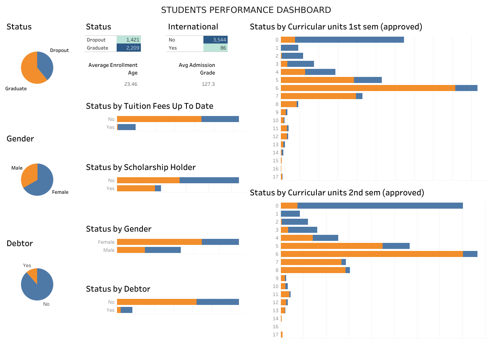

# Submission Akhir: Menyelesaikan Permasalahan Institusi Pendidikan

## Business Understanding
Jaya Jaya Institut menghadapi masalah serius terkait tingkat dropout siswa yang tinggi. Fenomena ini tidak hanya berdampak pada reputasi institusi, tetapi juga pada efisiensi operasional, alokasi sumber daya, dan potensi penerimaan mahasiswa baru di masa depan. Angka dropout yang signifikan menunjukkan adanya tantangan dalam retensi siswa dan keberhasilan studi.

## Permasalahan Bisnis
Institusi pendidikan mengalami tingkat dropout siswa yang tinggi, yang dapat menyebabkan dampak negatif seperti:
- Penurunan pendapatan dari biaya kuliah dan potensi subsidi.
- Peningkatan biaya operasional karena alokasi sumber daya yang tidak efisien untuk siswa yang akhirnya dropout.
- Penurunan reputasi institusi yang dapat memengaruhi penerimaan mahasiswa baru.
- Hilangnya potensi lulusan yang berkualitas yang dapat berkontribusi pada institusi dan masyarakat.

Namun, perusahaan belum memiliki sistem yang mampu:
- Mengidentifikasi secara dini siswa dengan risiko dropout tinggi.
- Menganalisis faktor-faktor utama yang menyebabkan dropout.
- Menyediakan alat bantu pengambilan keputusan berbasis data bagi manajemen dan tim akademik untuk intervensi proaktif.

Oleh karena itu, diperlukan sebuah solusi berbasis data untuk memahami akar masalah dropout dan mendukung strategi retensi siswa secara proaktif.

## Cakupan Proyek
- Eksplorasi dan analisis data siswa.
- Pembuatan model prediktif untuk status siswa (Graduate atau Dropout).
- Visualisasi data dan hasil analisis dalam bentuk dashboard Tableau Public.
- Deployment model prediktif menggunakan Streamlit.

## Persiapan
Sumber data: Data yang digunakan dalam proyek ini berasal dari informasi akademik siswa yang memuat berbagai informasi terkait riwayat studi, demografi, keuangan, serta status akhir siswa (Graduate atau Dropout). Sebelum digunakan untuk analisis, data ini terlebih dahulu dibersihkan menggunakan Notebook (data_cleaned.csv). Setelah proses ini, diperoleh data yang siap digunakan dalam proses eksplorasi data, pemodelan prediktif, serta pembuatan visualisasi interaktif untuk mendukung pengambilan keputusan oleh pihak institusi.

Setup environment:
```
# Clone repositori
git clone https://github.com/107rasyid/Menyelesaikan-Permasalahan-Institusi-Pendidikan

# Membuat virtual environment
python -m venv venv

# Mengaktifkan virtual environment
# Untuk Linux/MacOS
source venv/bin/activate
# Untuk Windows
.\venv\Scripts\activate

# Install dependencies
pip install -r requirements.txt
```

## Business Dashboard
Dashboard ini dirancang untuk menampilkan visualisasi analisis faktor-faktor yang memengaruhi status siswa (Graduate atau Dropout), distribusi demografi siswa, serta insight lainnya. Dashboard ini mempermudah pihak institusi dalam membuat keputusan berbasis data untuk strategi retensi dan peningkatan performa siswa.

Anda dapat mengakses dashboard interaktif melalui tautan berikut:

[Students Performance Dashboard](https://public.tableau.com/views/StudentsPerformanceDashboard_17477411023180/Dashboard1?:language=en-US&publish=yes&:sid=&:redirect=auth&:display_count=n&:origin=viz_share_link)

## Tampilan Dashboard

Berikut adalah tampilan *screenshot* dari *dashboard* yang telah dibuat:



## Hasil Analisis
### Faktor Penentu *Attrition*
Berdasarkan analisis Permutation Importance pada model SVM, berikut adalah fitur-fitur yang paling signifikan memengaruhi status akhir siswa (Graduate atau Dropout):

| Peringkat | Fitur            | Tingkat Pengaruh (Mean Importance) |
| --------- | ---------------- | ---------------- |
| 1         | `Curricular_units_2nd_sem_approved`       | 0.14            |
| 2         | `Tuition_fees_up_to_date`  | 0.065            |
| 3         | `Curricular_units_2nd_sem_grade`            | 0.043            |
| 4         | `Curricular_units_1st_sem_approved`      | 0.025            |
| 5         | `Scholarship_holder` | 0.016            |

### Performa Model Prediksi Status Siswa
Model Support Vector Machine (SVM) dimanfaatkan untuk memprediksi risiko seorang siswa mengalami dropout atau berhasil graduate. Proses pelatihan model ini melibatkan analisis seluruh data siswa yang ada, dengan mengandalkan berbagai fitur sebagai input prediksi. Model ini mampu mengidentifikasi siswa dengan karakteristik serupa dengan mereka yang telah dropout atau graduate sebelumnya, memberikan prediksi yang akurat untuk intervensi dini

### Performa Model
| Metric    | Testing |
| --------- | ------- |
| Accuracy  | 0.916   |
| Precision | 0.908   |
| Recall    | 0.959   |
| F1-Score  | 0.933   |

## Menjalankan Aplikasi Predict
```bash
`streamlit run src/prediction.py`
```
Buka *browser* di `http://localhost:8501`\
Isi *form input* sesuai data siswa\
Klik tombol **🔍 Prediksi**

## Conclusion
Berdasarkan analisis data siswa, beberapa faktor signifikan berkontribusi terhadap status kelulusan atau dropout di institusi pendidikan.

* **Faktor Akademis Kritis**: Curricular_units_2nd_sem_approved dan Curricular_units_2nd_sem_grade merupakan prediktor terkuat. Ini mengindikasikan bahwa performa dan kemajuan akademis siswa di semester kedua sangat krusial dalam menentukan apakah mereka akan lulus atau dropout. Kuantitas mata kuliah yang berhasil diselesaikan serta nilai yang diperoleh menjadi indikator utama.
* **Faktor Finansial dan Dukungan**: Tuition_fees_up_to_date dan Scholarship_holder menunjukkan pengaruh yang signifikan. Siswa yang memiliki tunggakan biaya kuliah cenderung berisiko tinggi untuk dropout, sementara penerima beasiswa memiliki peluang lebih besar untuk berhasil lulus. Ini menyoroti pentingnya stabilitas finansial dan dukungan bagi keberlangsungan studi siswa.
* **Performa Awal (Semester 1)**: Meskipun tidak sekuat semester 2, performa di semester pertama (Curricular_units_1st_sem_approved, Curricular_units_1st_sem_grade) juga memberikan indikasi awal terhadap status siswa.
* **Variabel Non-Akademis Lainnya**: Faktor seperti mode aplikasi (Application_mode), tingkat pengangguran (Unemployment_rate), dan program studi (Course) juga memiliki kontribusi, menunjukkan bahwa lingkungan eksternal dan pilihan awal siswa dapat memengaruhi jalur studi mereka.

## Rekomendasi Action Items (Optional)

Berdasarkan kesimpulan di atas, perusahaan Jaya Jaya Maju dapat mempertimbangkan tindakan berikut:

1.  **Pengawasan Akademis Dini dan Intervensi Semester 2**:Fokus pada pemantauan ketat terhadap kemajuan dan nilai siswa di semester kedua. Kembangkan sistem peringatan dini untuk siswa yang menunjukkan kesulitan dalam menyelesaikan unit kurikulum (Curricular_units_2nd_sem_approved) atau memiliki nilai rendah (Curricular_units_2nd_sem_grade). Sediakan program bimbingan belajar, tutor sebaya, atau konseling akademis yang ditargetkan untuk siswa berisiko tinggi di semester 2.
2.  **Dukungan Finansial Proaktif**: Perkuat sistem pemantauan status pembayaran biaya kuliah (Tuition_fees_up_to_date). Tawarkan opsi pembayaran fleksibel, bantuan finansial, atau informasi tentang beasiswa yang tersedia bagi siswa yang menunjukkan tanda-tanda kesulitan keuangan. Pertimbangkan untuk memperluas program beasiswa (Scholarship_holder) atau mengembangkan skema bantuan biaya kuliah bagi siswa berprestasi atau berisiko tinggi.
3.  **Program Adaptasi dan Dukungan Awal (Semester 1)**: Meskipun semester 2 lebih krusial, berikan perhatian pada performa di semester pertama. Program orientasi yang kuat, mentoring dari senior, dan dukungan akademis sejak awal dapat membantu siswa beradaptasi dan membangun fondasi yang kuat.
4.  **Mempertimbangkan Faktor Eksternal**: Mengingat pengaruh Unemployment_rate dan Application_mode, institusi dapat mempertimbangkan faktor ekonomi dan sosial dalam strategi penerimaan dan dukungan siswa. Memberikan informasi karir yang jelas atau membangun koneksi industri dapat memotivasi siswa.

## Kontak
- Nama: Rasyid Alfiansyah
- Email: `rasyidalfiansyh@gmail.com`
- Dicoding ID: rasyid_alfiansyah